# MMagic 服务计算巢部署使用文档
## 概述

使用计算巢，您可以一键秒级部署MMagic 环境，即刻开启MMagic的 AIGC之旅。不使用计算巢，您可能需要花费数小时、甚至更长的时间在环境准备、服务部署上。基于计算巢可以极大提升你的工作效率，把精力集中在业务算法逻辑之上。

MMagic (Multimodal Advanced, Generative, and Intelligent Creation) 是一个供专业人工智能研究人员和机器学习工程师去处理、编辑和生成图像与视频的开源 AIGC 工具箱。
MMagic 允许研究人员和工程师使用最先进的预训练模型，并且可以轻松训练和开发新的定制模型。
MMagic 支持各种基础生成模型，包括：

- 无条件生成对抗网络 (GANs)
- 条件生成对抗网络 (GANs)
- 内部学习
- 扩散模型
- 还有许多其他生成模型即将推出！

MMagic 支持各种应用程序，包括：

- 图文生成
- 图像翻译
- 3D 生成
- 图像超分辨率
- 视频超分辨率
- 视频插帧
- 图像补全
- 图像抠图
- 图像修复
- 图像上色
- 图像生成
- 还有许多其他应用程序即将推出！

## 实例说明
MMagic部署的为社区开源版本，源码参考[Github Repo](https://github.com/open-mmlab/mmagic)，目前可以选择的实例规格如下:

| 规格族                  | vCPU与内存       | 系统盘 | GPU/FPGA             |
|-------------------------|------------------|--------|----------------------|
| ecs.gn7i-c16g1.4xlarge  | 16 vCPU 60 GiB   | 200G   | 1 * NVIDIA A10 (24G) |
| ecs.gn7i-c32g1.8xlarge  | 32 vCPU 188 GiB  | 200G   | 1 * NVIDIA A10 (24G) |
| ecs.gn7i-c32g1.16xlarge | 64 vCPU 376 GiB  | 200G   | 2 * NVIDIA A10 (24G) |
| ecs.gn7i-c32g1.32xlarge | 128 vCPU 752 GiB | 200G   | 4 * NVIDIA A10 (24G) |

预估费用在创建实例时可实时看到。

## 部署流程

### 0. 准备工作

在正式开始使用前，您需要一个阿里云账号，对ECS、VPC等资源进行访问和创建操作。

- 若您使用个人账号，可以直接创建服务实例
- 若您使用RAM用户创建服务实例，且是第一次使用阿里云计算巢
  - 需要在创建服务实例前，对使用的RAM用户的账号添加相应资源的权限。添加RAM权限的详细操作，请参见[为RAM用户授 权](https://help.aliyun.com/document_detail/121945.html)。所需权限如下表所示。
  - 且需要授权创建关联角色，参考下图，选中 **同意授权并创建关联角色**


### 1. 部署入口
您可以在阿里云计算巢自行搜索，也可以通过下述部署链接快速到达。
[部署链接](https://computenest.console.aliyun.com/user/cn-hangzhou/serviceInstanceCreate?spm=5176.24779694.0.0.5fce4d22DcSm3X&ServiceId=service-ffad3a27316440039df3&ServiceVersion=draft)

### 2. 创建服务实例

点击创建连接：
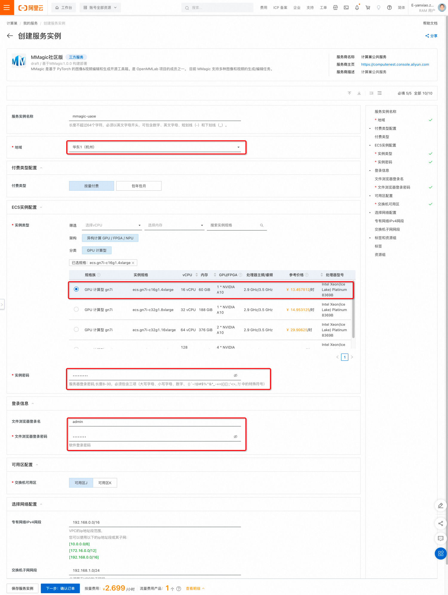
点击「确认订单」进入：

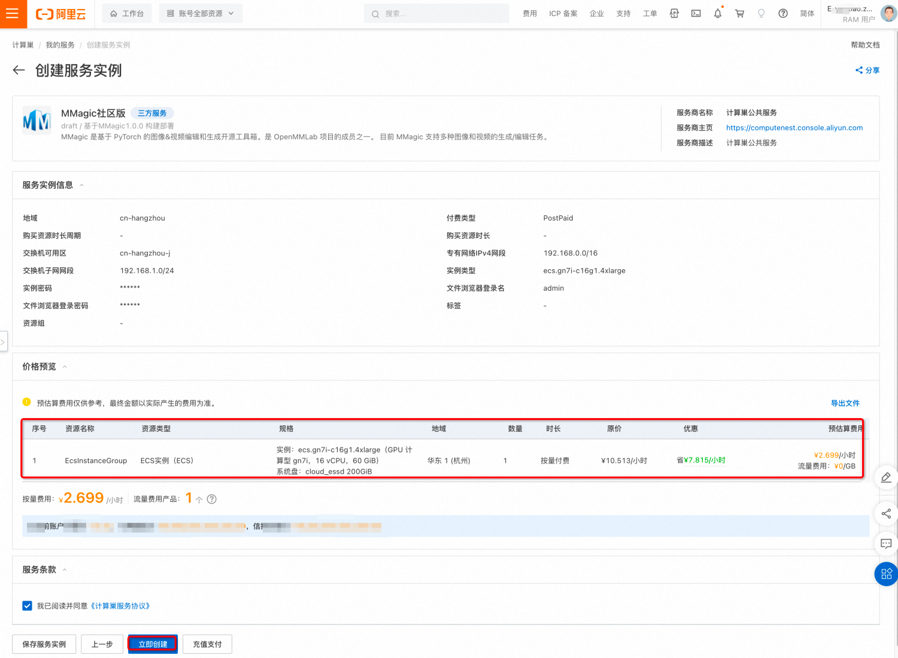

确认订单信息后，点击「立即创建」：


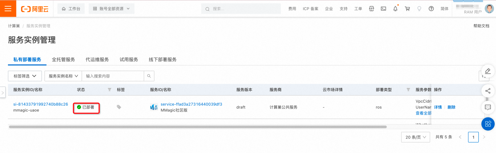
等待服务实例状态为「已部署」后点击前面实例ID链接，进入服务实例详情页面：

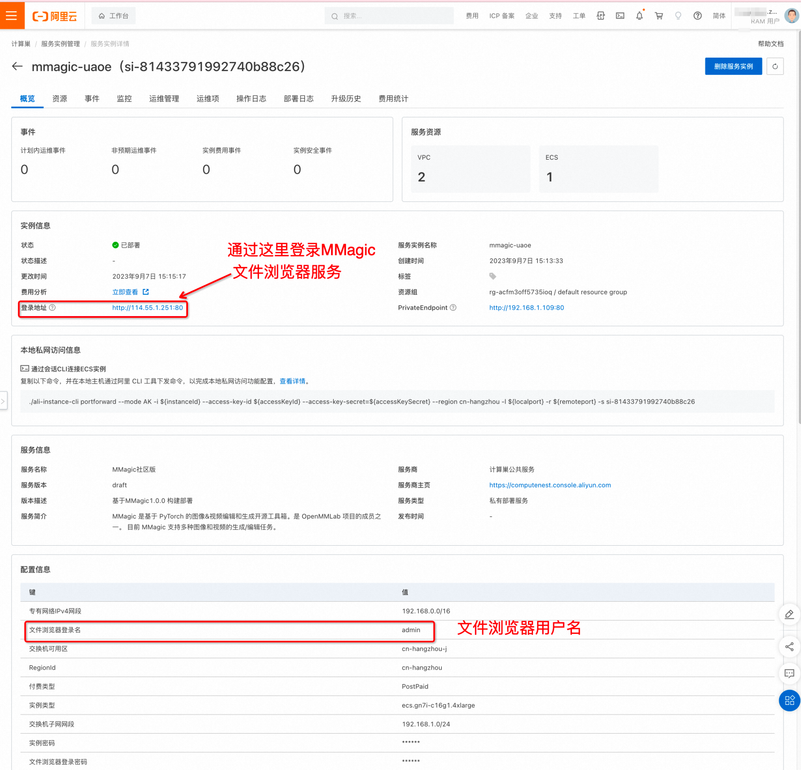

点击「登录地址」，进入文件浏览器：

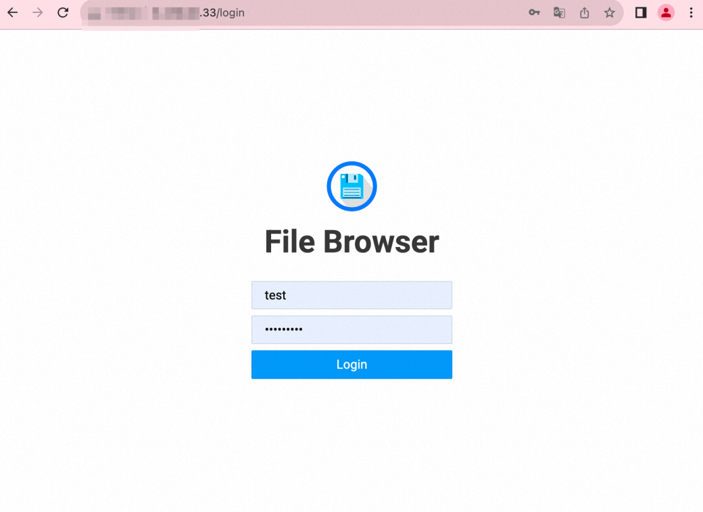

输入创建服务实例输入的用户名和密码登录：
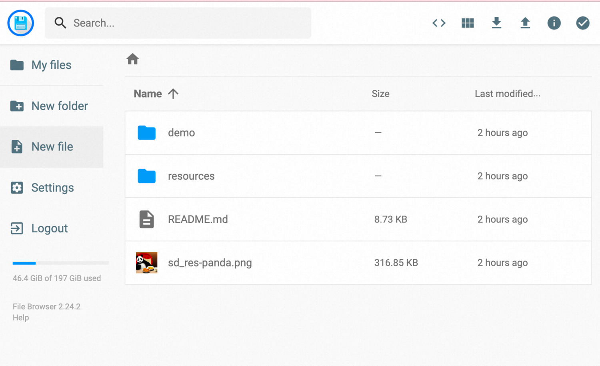

后续在实例上进行的MMagic 推理示例的结果即可在这里方便查看。
## 实例演示
### 执行环境

通过计算巢创建MMagic的服务实例后，需要进入命令行控制台：

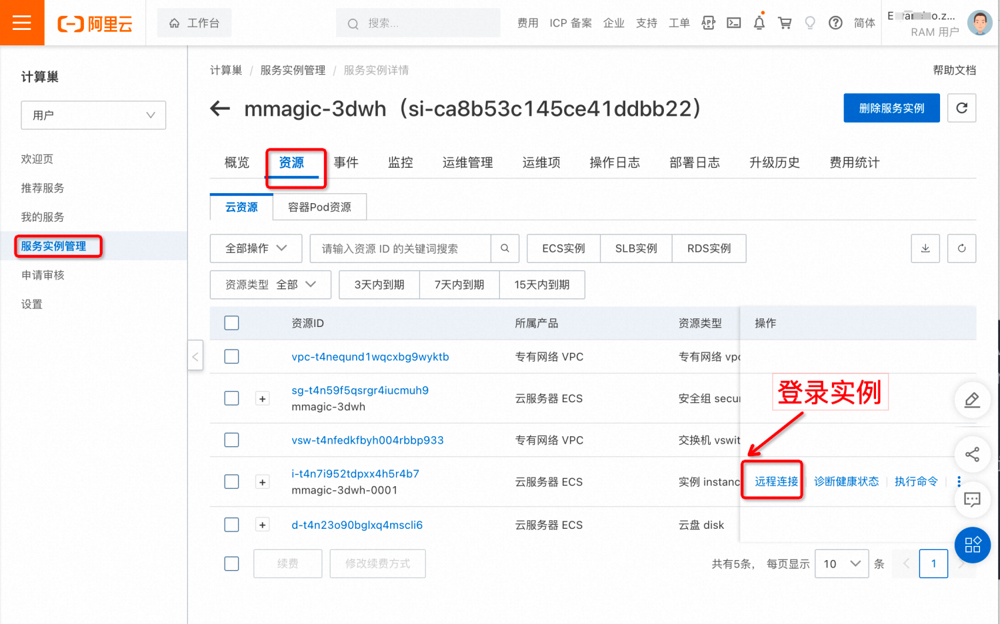

点击远程连接：

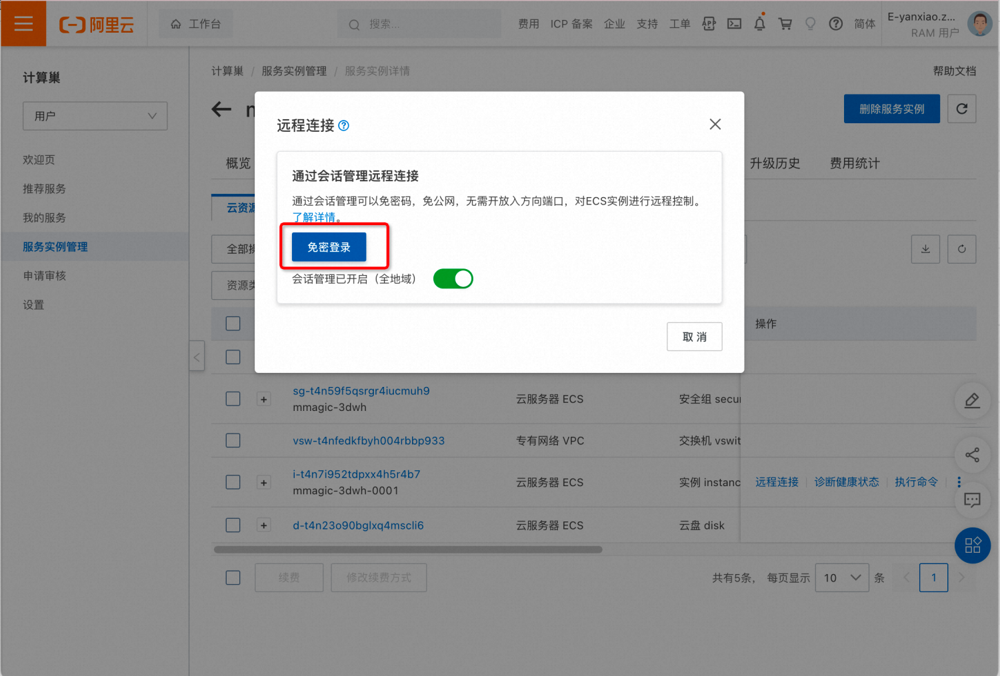

点击免密登录：

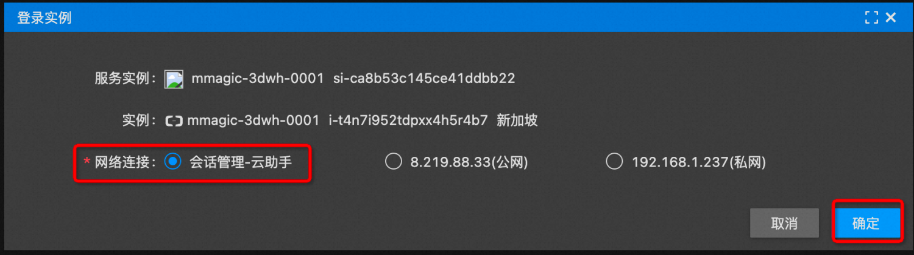

使用默认会话管理登录：

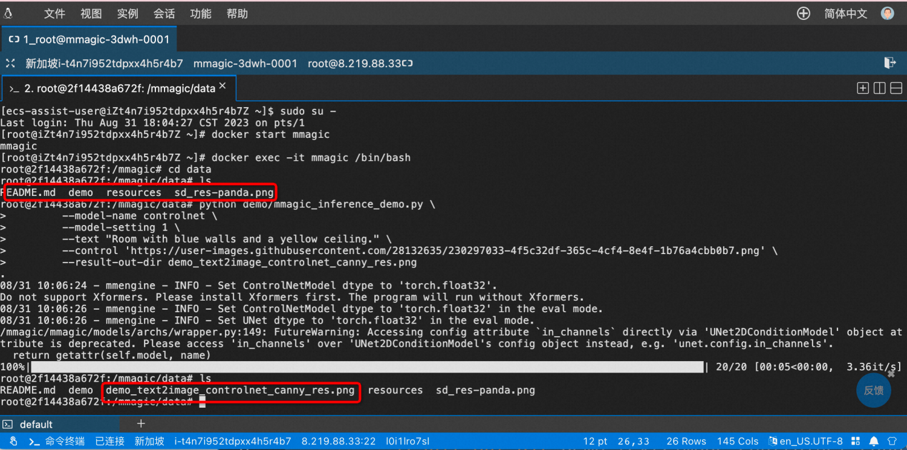

```shell
sudo su - # 进入root
docker start mmagic
docker exec -it mmagic /bin/bash
cd data
## run the following example cases
```

如上的data目录可以通过本机提供的web服务查看，下面演示的内容输出的图片内容，也可以通过浏览器直接查看：

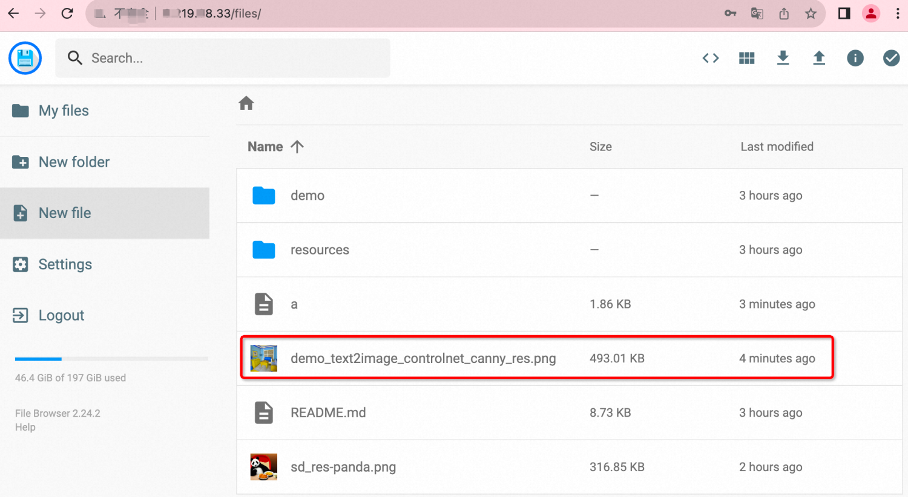

### Text-to-Image(文生图)

基于 stable diffusion 模型进行文生图：

```shell
python demo/mmagic_inference_demo.py \
        --model-name stable_diffusion \
        --text "A panda is having dinner at KFC" \
        --result-out-dir demo_text2image_stable_diffusion_res.png
```


controlnet-canny

```shell
python demo/mmagic_inference_demo.py \
        --model-name controlnet \
        --model-setting 1 \
        --text "Room with blue walls and a yellow ceiling." \
        --control 'https://user-images.githubusercontent.com/28132635/230297033-4f5c32df-365c-4cf4-8e4f-1b76a4cbb0b7.png' \
        --result-out-dir demo_text2image_controlnet_canny_res.png
```

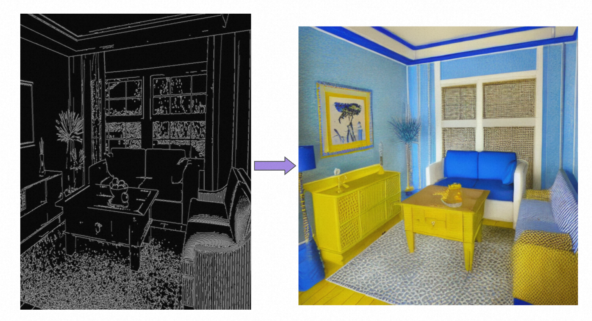


controlnet-pose
```shell
python demo/mmagic_inference_demo.py \
        --model-name controlnet \
        --model-setting 2 \
        --text "masterpiece, best quality, sky, black hair, skirt, sailor collar, looking at viewer, short hair, building, bangs, neckerchief, long sleeves, cloudy sky, power lines, shirt, cityscape, pleated skirt, scenery, blunt bangs, city, night, black sailor collar, closed mouth" \
        --control 'https://user-images.githubusercontent.com/28132635/230380893-2eae68af-d610-4f7f-aa68-c2f22c2abf7e.png' \
        --result-out-dir demo_text2image_controlnet_pose_res.png
```

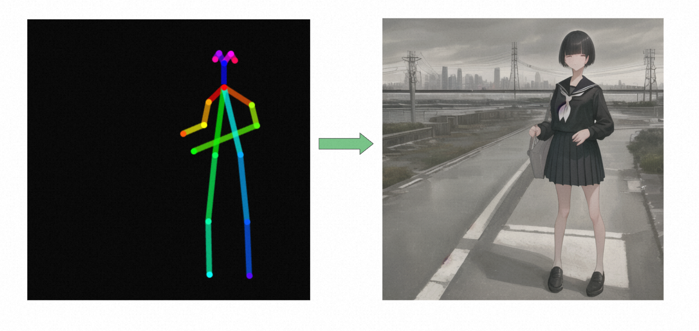


### Image Translation（图像翻译）

```shell
python demo/mmagic_inference_demo.py \
        --model-name pix2pix \
        --img ./resources/input/translation/gt_mask_0.png \
        --result-out-dir demo_translation_pix2pix_res.png
```

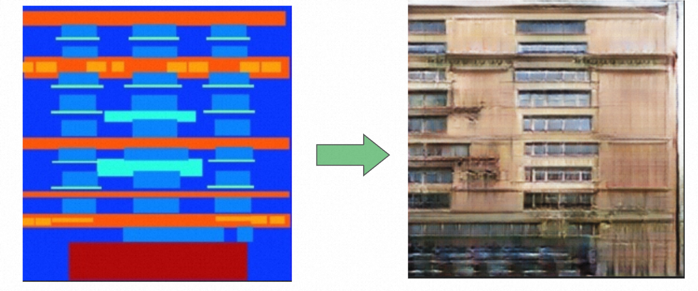
### Image Super-resolution (图像超分)

```shell
python demo/mmagic_inference_demo.py \
        --model-name esrgan \
        --img ./resources/input/restoration/0901x2.png \
        --result-out-dir demo_restoration_esrgan_res.png
```

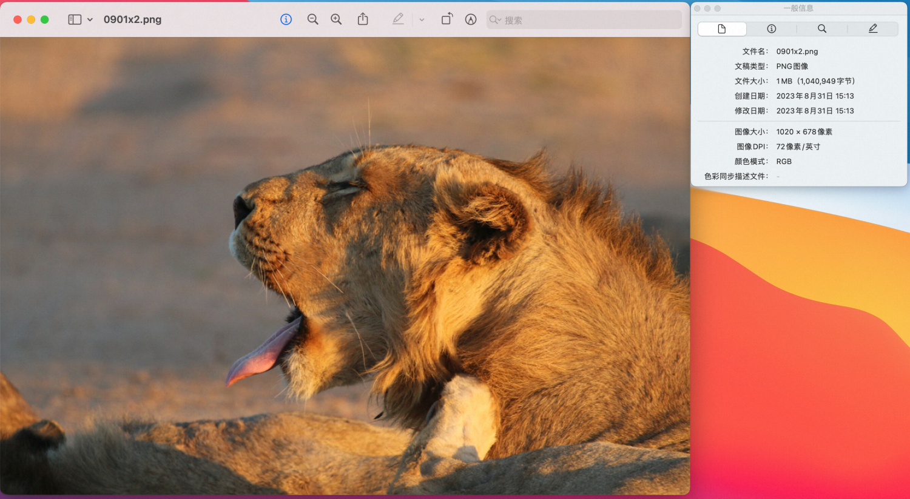

通过图像超分之后得到的超分图像信息如下：


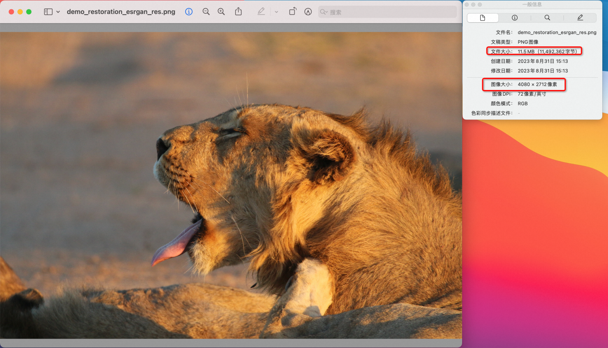


### 更多示例

更多示例请参考文件浏览器的 README.md

其中也包含视频处理相关的，期待您更深入的探索，也欢迎一起实践并补充相应案例到本文档。

## 参考

[1]: [https://mmagic.readthedocs.io/zh_CN/latest/](https://mmagic.readthedocs.io/zh_CN/latest/)
[2]: [https://zhuanlan.zhihu.com/p/624831412](https://zhuanlan.zhihu.com/p/624831412)
[3]: [https://zhuanlan.zhihu.com/p/637904586](https://zhuanlan.zhihu.com/p/637904586)
